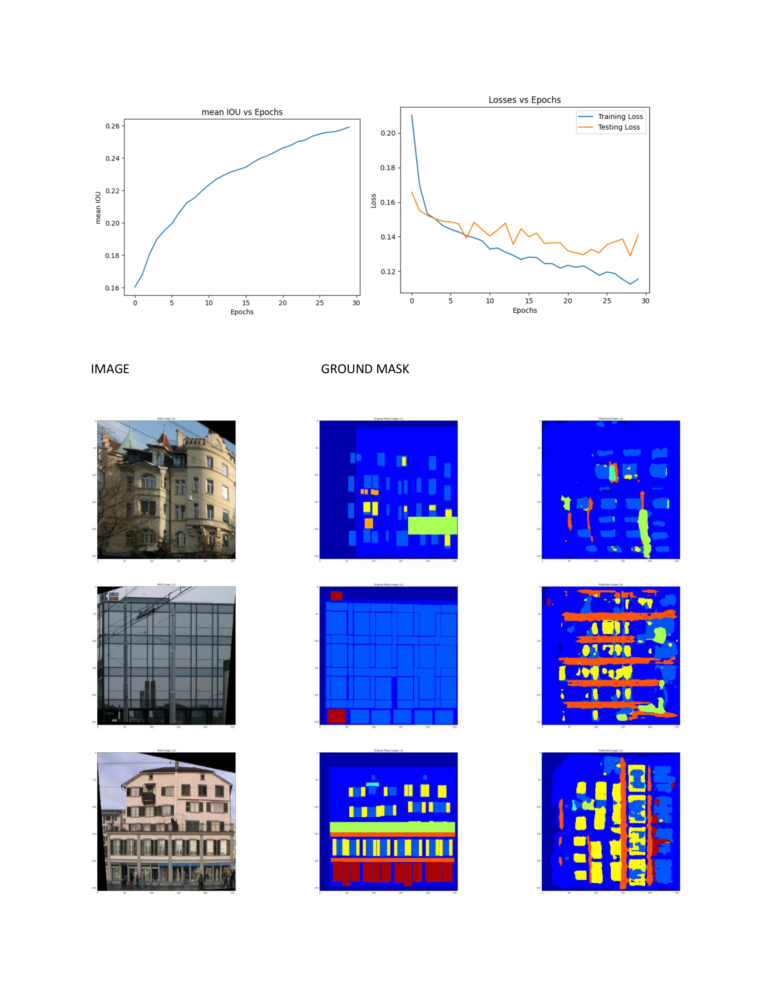
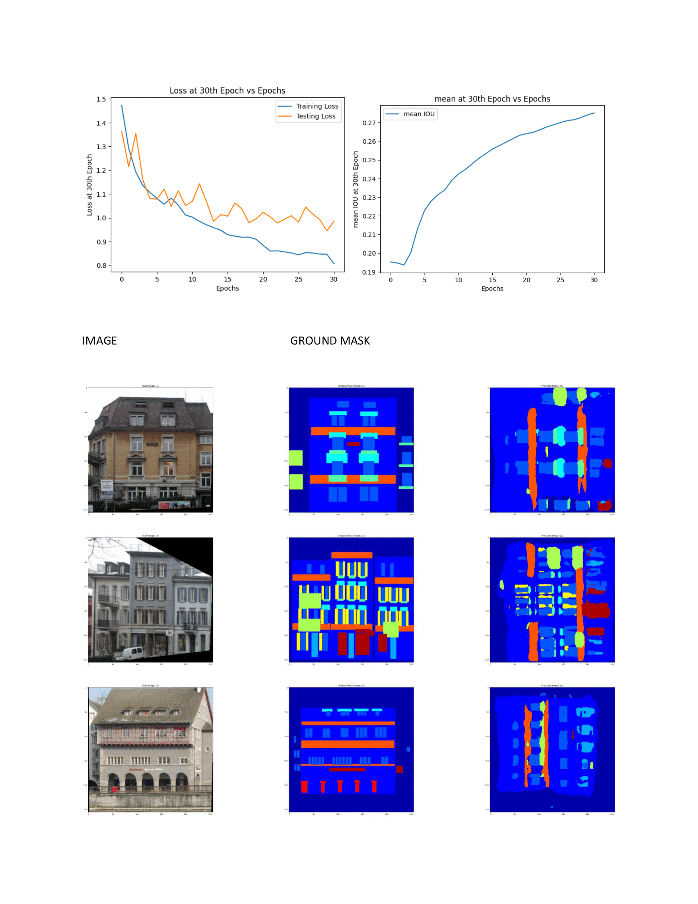

# Semantic Segmentation using SegFormer Transformers

This is example for an Fine-tunning of SegFormer Transformer on Facade Database, where we have train Segformer Encoder-Decoder and also Auxillary Net. These Auxillary Network also train and save embeddings for new data. We have brought decent scores for meanIOU and Losses degrading smoothly.  
###Note -> For Detailing expirementation results Please visit [Report for Semantic Segmentation using SegFormer and CMP Facade Database.pdf] report file  
Below I will paste 2 expirements evaluation :-

a) BCE Loss

b) using CrossEntropy Loss in 2nd Expirement

 
